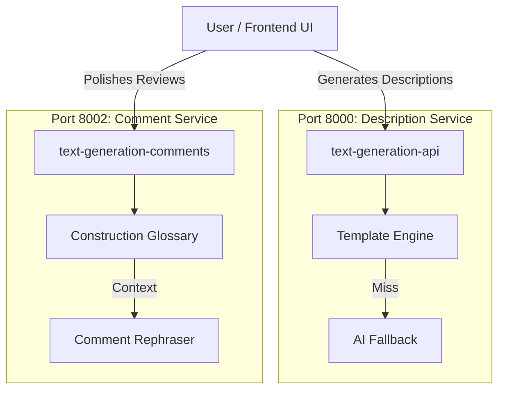

# Krion AI System - Technical Documentation

This document provides an in-depth technical overview of the Krion 6D AI integration. The system is designed as a modular microservices architecture to provide intelligent text generation and refinement capabilities for construction project management.

---

## 🏗️ System Architecture

The solution acts as a Mono-repo containing two distinct, decoupled microservices.

---

## 1. Comment Rephraser Service (`text-generation-comments`)

*   **Port**: `8002`
*   **Goal**: Transform short, informal, or messy engineer notes into professional, contract-grade review comments.

### 🛠️ Tech Stack
*   **Framework**: FastAPI (Python 3.10+)
*   **Validation**: Pydantic v2
*   **AI Engine**: Supports OpenAI (GPT-3.5/4), Groq (Llama 3), Google Gemini (Flash 2.0).
*   **Frontend**: Native HTML/CSS/JS (embedded in `frontend/` folder).
*   **Knowledge Base**: Custom dictionary + Fuzzy matching (Python `difflib`).

### ⚙️ Process Workflow

When a user clicks the "Magic Wand" <i class="fas fa-wand-magic-sparkles"></i>:

1.  **Input Reception**: The API receives simple text (e.g., "iim colum bad").
2.  **Glossary Retrieval (RAG-lite)**:
    *   The system scans `construction-terms.txt`.
    *   Uses **Fuzzy Logic** to correct typos: *'iim'* is mapped to *'BIM'*, *'colum'* to *'Column'*.
    *   Retrieves official definitions to ground the AI.
3.  **Prompt Engineering**:
    *   A dynamic prompt is built including: User Input + Review Status (Reject/Submit) + Glossary Definitions.
    *   **Strict Rule Enforced**: Output must be in 3 styles: `[FORMAL]`, `[FRIENDLY]`, `[CONCISE]`.
4.  **Generation & Parsing**:
    *   The LLM generates the response.
    *   The backend parses the 3 labeled sections into structured JSON.
5.  **Correction Tracking**:
    *   The APIs return the corrections made (e.g., "Expanded 'rebar' to 'Reinforcement Bar'").

### 📂 Folder Structure
*   `app/routers/`: API endpoints (`/rephrase-comment`).
*   `app/services/`:
    *   `comment_rephraser.py`: Core AI logic and prompt building.
    *   `construction_terms.py`: Glossary loader and fuzzy matcher.
*   `frontend/`: The "Submit Review" UI code.

---

## 2. Description Generator Service (`text-generation-api`)

*   **Port**: `8000`
*   **Goal**: Generate full-length descriptions for entities like RFIs, Issues, or Reviews based on metadata.

### 🛠️ Tech Stack
*   **Framework**: FastAPI
*   **Templating**: Jinja2 (for high-performance pattern matching).
*   **AI Engine**: Hybrid (local logic + LLM fallback).

### ⚙️ Process Workflow

1.  **Request**: User sends structured JSON (e.g., `{"type": "RFA", "subject": "Casting", "date": "2024-01-01"}`).
2.  **Template Strategy (Fast Path)**:
    *   System checks `templates/entity_templates.json`.
    *   If a matching template exists for the `type` + `subject` pattern, it fills fields instantly.
    *   **Latency**: < 10ms.
3.  **AI Strategy (Smart Path)**:
    *   If no template matches, the request is forwarded to the LLM.
    *   The AI crafts a unique description based on the context.
    *   **Latency**: ~1-2s.

### 📂 Folder Structure
*   `app/services/`:
    *   `generator.py`: The "Orchestrator" deciding between Template vs AI.
    *   `ai_generator.py`: Handles the LLM connection.
    *   `template_generator.py`: Handles Jinja2 logic.
*   `templates/`: JSON definitions of standard descriptions.

---

## 🔐 Security & Configuration
*   **Environment Variables**: All API keys are stored in `.env` files (excluded from Git).
*   **CORS**: Both services are configured to allow cross-origin requests (for easy frontend integration).
