```mermaid
graph LR
    A[User Data] --> B{Have Template?}
    B -- Yes --> C[⚡ Use Template]
    B -- No --> D[🤖 Ask AI]
    C --> E[Final Description]
    D --> E
```

```mermaid
graph TD
    Input[Input: 'iim colum bad'] --> Glossary{📚 Dictionary Check}
    Glossary -->|Fix Typos| Context[Context: 'BIM', 'Column']
    Context --> AI[🤖 AI Model]
    AI --> Option1[Formal Option]
    AI --> Option2[Friendly Option]
    AI --> Option3[Concise Option]
```

# 📘 How It Works: The Simpler Guide

This guide explains clearly what happens "under the hood" when you use the Krion AI features.

---

## 1. Description Generator (The "Smart Form Filler")
**Goal:** You have data (like an Issue or RFI), and you need a long, professional description written automatically.

### The "Two-Step" Logic
Think of this system like a **smart receptionist**:
1.  **Step 1: The Cheat Sheet (Templates)**  
    First, the system looks at a list of pre-written answers.
    *   *System asks:* "Do I already know how to describe a 'Concrete Pour RFI'?"
    *   *If YES:* It instantly fills in the blanks. **(Super Fast: 0.01s)**
    *   *If NO:* It goes to Step 2.

2.  **Step 2: The Creative Writer (AI)**
    If there is no cheat sheet, the system calls the AI.
    *   *System says:* "I haven't seen this before. AI, please write a description for a 'Concrete Pour' with these details..."
    *   *AI replies:* Writes a unique, perfect paragraph. **(Slower but Smart: 2s)**

### 🧩 Visual Workflow

---

## 2. Comment Rephraser (The "Professional Polisher")
**Goal:** You type a short, messy note, and the system turns it into a professional review comment.

### The "Construction Filter" Workflow
Think of this as a **cleaning machine** for your text.

1.  **Step 1: The Messy Input**
    *   You type: *"iim colum bad"*
    *   *Problem:* It has typos ("colum"), slang ("iim"), and is too short.

2.  **Step 2: The Dictionary Check (Glossary)**
    *   The system looks at your custom **Construction Dictionary**.
    *   It spots "iim" → matches it to **"BIM (Building Information Model)"**.
    *   It spots "colum" → matches it to **"Column"**.
    *   *Result:* It now understands you mean "BIM Column".

3.  **Step 3: The Style Chef (AI Prompting)**
    *   The system sends your corrected text to the AI with specific orders:
        *   "Make one version **Formal**."
        *   "Make one version **Friendly**."
        *   "Make one version **Short**."
    *   *Result:* The AI cooks up 3 distinct options.

4.  **Step 4: The Final Menu**
    *   You see 3 choices:
        1.  **[FORMAL]** "The BIM column model contains significant errors."
        2.  **[FRIENDLY]** "Could you please check the BIM column model?"
        3.  **[CONCISE]** "BIM column model incorrect."

### 🧩 Visual Workflow

